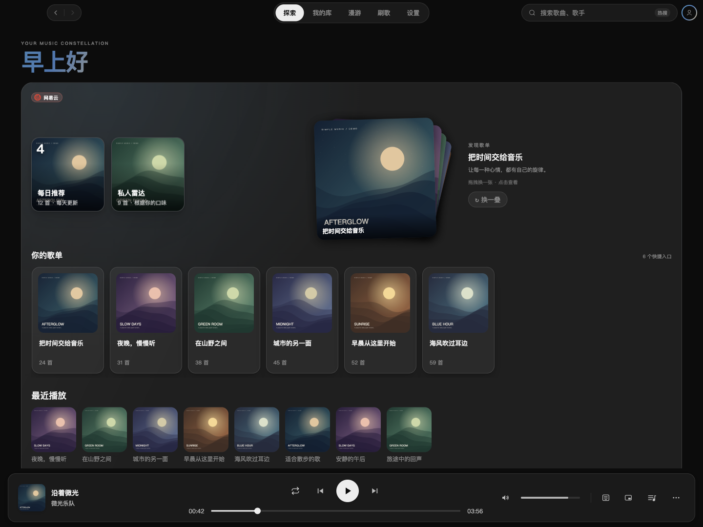
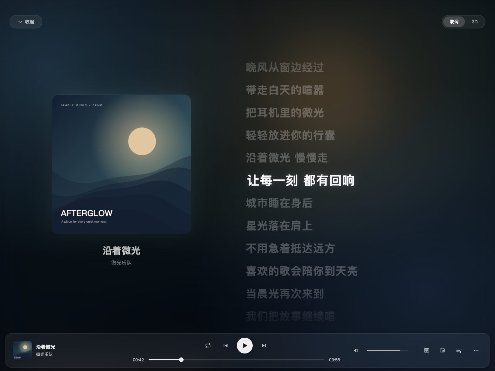
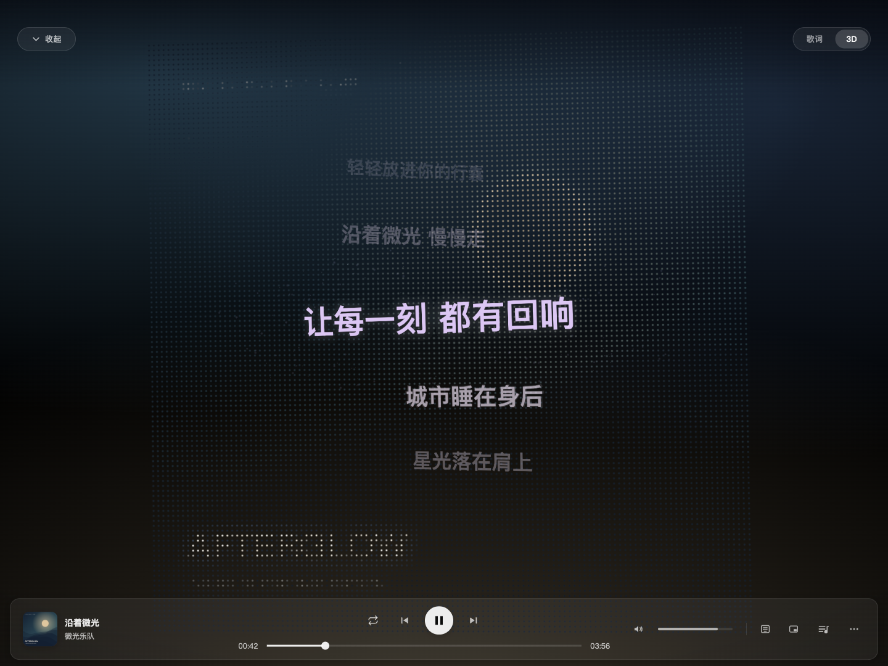
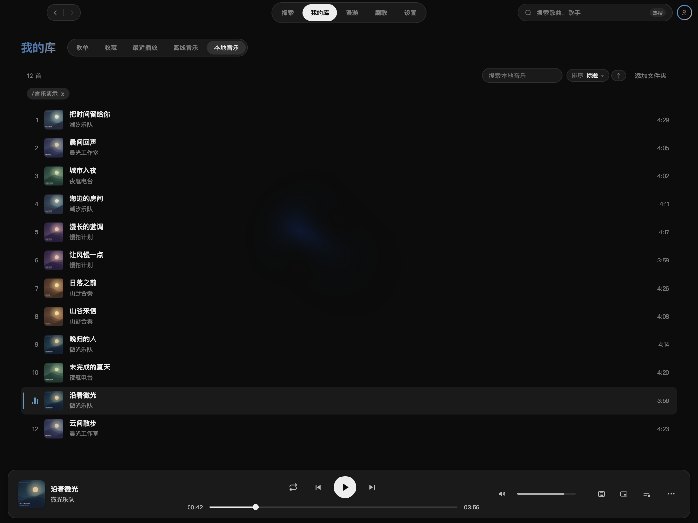
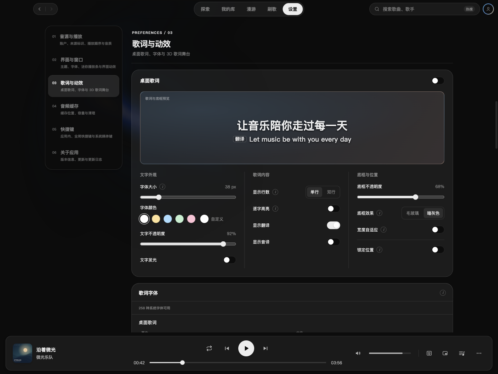
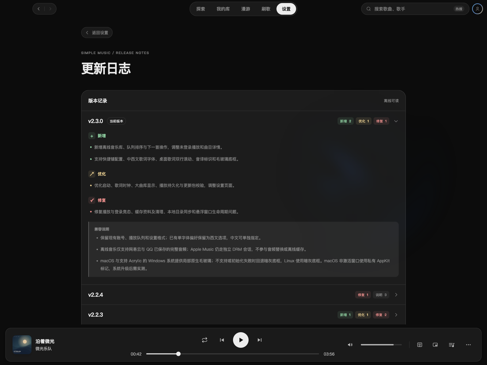

# Simple Music

把网易云音乐、QQ 音乐、Apple Music 和本地音乐放进同一个桌面播放器。浏览熟悉的歌单与推荐，整理播放队列，也可以打开歌词、迷你播放条或动态壁纸，换一种方式听歌。

支持 **macOS 与 Windows**。在线平台需要分别登录并启用，歌曲与音质的可用范围取决于账号权限和平台服务。

[下载安装](https://github.com/Yyyangshenghao/simple-music/releases/latest) · [首次使用](#首次使用) · [功能与边界](#功能与边界) · [参与开发](#参与开发)

## 界面一览

从找歌到跟唱，再到整理自己的音乐，每个场景都有适合它的界面。以下为当前开发版本的实际界面截图；歌单、曲目、封面与歌词使用演示数据。点击图片可查看大图。

| 探索音乐 · 发现下一首喜欢的歌 | 普通歌词 · 把注意力交给这一句 |
|---|---|
| [](./docs/screenshots/explore.png) | [](./docs/screenshots/lyrics.png) |
| 每日推荐、私人雷达和歌单叠卡，让找歌多一点惊喜。 | 封面氛围色与滚动歌词相伴，当前一句始终清晰。 |

| 3D 歌词 · 让文字走进舞台 | 我的库 · 留住自己的音乐 |
|---|---|
| [](./docs/screenshots/lyrics-3d.png) | [](./docs/screenshots/library.png) |
| 封面化成粒子云，歌词在有深度的空间里浮动。 | 歌单、收藏、离线与本地音乐各就各位；图中展示本地音乐。 |

| 设置 · 调成你喜欢的样子 | 更新日志 · 看见每一次变化 |
|---|---|
| [](./docs/screenshots/settings.png) | [](./docs/screenshots/update-history.png) |
| 字体、颜色、歌词与动效，边预览边调整。 | 从独立页面查看各版本，按新增、优化与修复读懂变化。 |

## 下载安装

前往 [Releases](https://github.com/Yyyangshenghao/simple-music/releases/latest)，选择适合自己电脑的安装包。

| 系统 | 下载文件 | 安装方式 |
|---|---|---|
| macOS · Apple 芯片 | `Simple Music-<version>-arm64.dmg` | 打开镜像，将应用拖入「应用程序」 |
| macOS · Intel 芯片 | `Simple Music-<version>.dmg`（不带 `arm64`） | 同上 |
| Windows · x64 安装版 | `Simple Music-<version>-Setup.exe` | 按安装向导操作，推荐日常使用 |
| Windows · x64 便携版 | `Simple Music-<version>-portable.exe` | 双击运行，更新时手动下载新版 |

Mac 的芯片类型可在苹果菜单 →「关于本机」查看。应用内「设置 → 关于应用」提供检查更新入口；macOS 下载后需要手动完成安装包替换，Windows 便携版需要自行更新。

## 首次使用

1. **连接音乐平台**：打开「设置 → 音源与账户」，登录想使用的平台，再打开对应启用开关。Apple Music 需要有效订阅才能播放完整歌曲。
2. **开始找歌**：使用顶栏搜索，或进入「探索」「我的库」浏览推荐、歌单与收藏。页面右侧的平台切换入口控制探索和我的库的内容来源。
3. **听自己的音乐**：进入「我的库 → 本地音乐」，点击「添加文件夹」。本地文件无需在线账号；应用会读取内嵌标签、封面和同名 `.lrc` 歌词。
4. **调成自己的习惯**：在设置里选择音质、主题、歌词字体和快捷键，再按需要启用桌面歌词、迷你播放条或动态壁纸。

在线平台的登录与启用状态相互独立。账号失效时可回到设置重新登录；已有本地文件与已保存的离线音乐仍可使用。

## 日常听歌

### 找歌与整理

- **探索与我的库**：保留各平台自己的推荐与资料库内容，不提供「全部平台」视图；搜索可以从已启用平台寻找歌曲。
- **漫游与刷歌**：沿歌手关系探索、生成漫游歌单，或逐首试听推荐歌曲。
- **播放队列**：设为下一首、调整顺序、移除曲目，搭配断点续播与睡眠定时。

### 随时看歌词

- 歌词页提供普通歌词与 3D 舞台，支持逐字高亮、翻译和音译；具体内容取决于歌词来源。
- 桌面歌词支持单行／双行、字体调整、宽度自适应与锁定；迷你播放条适合腾出主窗口空间。
- 深浅主题、封面氛围色、可视化场景与动态壁纸可按喜好调整，视觉参数支持存档导入和导出。
- 应用内快捷键、全局快捷键及系统媒体键可在设置中配置。

### 为离线听歌做准备

网易云与 QQ 曲目可通过播放栏菜单的「保存到本地」保存完整音频，随后在「我的库 → 离线音乐」搜索、排序与播放。缓存目录、容量及清理选项位于设置中。

自动播放缓存与主动保存的离线歌曲分开管理：自动缓存可能被容量清理淘汰，想长期离线收听的歌曲应主动保存。Apple Music 不支持音频下载或离线保存。

## 功能与边界

| 来源 | 账号与播放 | 音质与离线 |
|---|---|---|
| 网易云音乐、QQ 音乐 | 分别登录并启用；播放受版权、会员与接口状态限制 | 可选音质，实际以账号可用档位为准；支持完整音频缓存与离线保存 |
| Apple Music | 有效订阅及可用连接；使用独立受保护播放会话 | 不提供音质档位、倍速或离线保存 |
| 本地音乐 | 添加电脑上的音乐文件夹，无需在线账号 | 读取本机原文件，不参与在线平台的音频接力 |

网易云与 QQ 的「播放接力」可在当前平台无法播放时，按设置顺序尝试其他已启用平台的同曲版本；是否找到可播版本取决于平台权限与匹配结果。Apple Music 不参与跨平台音频替换，歌词缺失时可以从已启用平台匹配同曲歌词。

Apple Music 的可视化频谱取决于系统是否允许捕获受保护音频；无法捕获时仍可正常播放。在线接口可能随平台改版失效，本项目不保证所有平台功能始终可用。

## 更新日志与反馈

点击「设置 → 关于应用 → 更新日志」，进入独立页面，按新增、优化、修复等类别查看当前版本与历史版本的变化，也可阅读兼容说明。记录离线可读，旧版本可展开查看。新版本的安装包和发行说明发布在 [Releases](https://github.com/Yyyangshenghao/simple-music/releases)。

遇到问题或有功能建议，请前往 [Issues](https://github.com/Yyyangshenghao/simple-music/issues)。反馈问题时附上应用版本、系统与芯片类型、复现步骤，以及相关截图或日志。

## 参与开发

使用 Electron（CastLabs ECS）、React、TypeScript、Zustand、electron-vite 与 Three.js。

```bash
npm ci
npm run dev           # 启动桌面应用，内嵌 API 随主进程运行
npm run typecheck     # 检查主进程与渲染层类型
npm test              # 运行测试
npm run build         # 构建源码，不生成安装包
```

独立 API 调试可用 `npm run server:dev`（默认端口 `35530`）。开发模式下，Apple Music 受保护播放使用本机 Chrome；正式安装包通过 CastLabs EVS 签名后使用应用内窗口。

实现入口见 [文档导航](./docs/README.md)，分支与提交规则见 [协作规范](./CONTRIBUTING.md)，安装包、版本升级和发布流程见 [构建与发布](./docs/build-and-release.md)。

## 免责声明

本项目为个人学习与技术交流用途，不是网易云音乐、QQ 音乐或 Apple Music 的官方产品，也不代表相关平台。项目不托管或分发音乐内容；音频缓存与离线保存发生在使用者本机。请遵守所用平台的服务条款与适用法律。若相关权利方认为本项目存在侵权内容，请联系作者处理。

## 鸣谢与来源

- **[XxHuberrr/Mineradio](https://github.com/XxHuberrr/Mineradio)（GPL-3.0）**—— 本项目的起点。Simple Music 最初是这个项目的移植式重写：整体架构（Electron 主进程模块化、React + TypeScript 渲染层、electron-vite 构建、跨平台适配）已经完全重写，但 `server/lib/dj-analyzer.ts` 的 BPM/节拍分析算法、`electron/platform/win32.ts` 的桌面壁纸注入与鼠标轮询脚本、`server/routes/*` 部分接口的业务逻辑，是在保留原有算法/逻辑的前提下移植为 TypeScript 的，属于 GPLv3 意义上的衍生代码。这也是本项目 license 是 GPL-3.0 而不是更宽松协议的原因。
- [NeteaseCloudMusicApi](https://github.com/Binaryify/NeteaseCloudMusicApi)（MIT，Binaryify）—— 网易云音乐接口封装，作为直接依赖使用。
- QQ 音乐接口部分在实现与文档整理时参考、交叉核对了以下开源逆向项目（均未直接引入代码，接口来源见 [QQ 音乐接口文档](./docs/qq-music-api.md)）：[l-1124/QQMusicApi](https://github.com/l-1124/QQMusicApi)（Python）、[copws/qq-music-api](https://github.com/copws/qq-music-api)（JS）、[jsososo/QQMusicApi](https://github.com/jsososo/QQMusicApi)（Node.js）。

以上项目均为非官方逆向实现，QQ 音乐、网易云音乐无面向个人开发者的公开 OpenAPI，相关接口存在随上游改版失效的风险。

## License

[GPL-3.0](./LICENSE) © yshAM

沿用参考项目 [Mineradio](https://github.com/XxHuberrr/Mineradio) 的 GPL-3.0 协议：可以自由使用、修改、分发，但基于本项目的二次分发（包括分发编译后的安装包）也必须遵循 GPL-3.0，公开对应源码。
