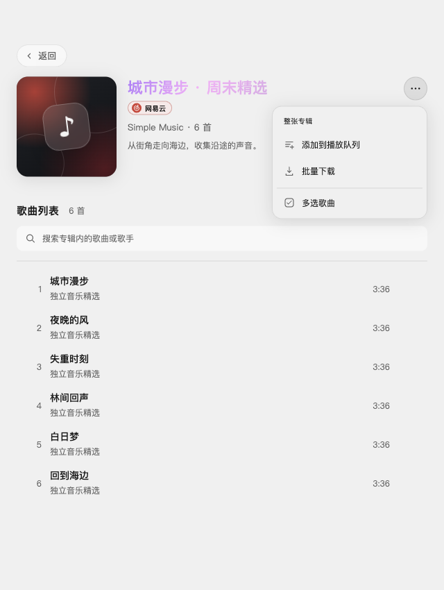

# 2.3.1 歌单与专辑详情操作收纳验收

日期：2026-10-06。工作分支 `feature/compact-playlist-actions`，目标 `dev/2.3.1`。本地集成供用户测试，不推送或发布。

## 行为

- 默认详情取消常显的整批操作栏与独立多选按钮，标题旁保留轻量“…”入口；菜单内提供追加播放队列、批量下载和多选歌曲。
- 进入多选后保留现有吸顶操作栏、勾选、鼠标框选和快捷键。搜索页的多选入口与操作栏沿用现有行为。
- 菜单支持上下箭头、Home/End、Esc、点击外部及焦点离开关闭；从菜单进入多选时聚焦选择容器。执行操作后收起菜单，处理中显示旋转提示，可重新打开取消。
- 复用原批量处理与账号/取消守卫，不新增第三方歌单写入能力，也不调整缓存或歌曲文件目录。

## 验证

- 类型检查、190 个文件 / 1,526 项测试及 `git diff --check` 通过。独立只读复审未发现阻断问题。未执行生产构建。
- 隔离 macOS Electron 开发窗口使用受控的六首歌曲，验证默认隐藏操作栏、菜单三项操作、箭头/End/Esc与返回焦点、外部点击、进入多选后快捷键全选和退出。
- 整单六首追加到队列且保持原播放索引；六首加入暂停的下载队列。长请求取消后的迟到响应没有追加曲目；同平台账号变化关闭菜单；搜索歌曲多选仍显示对应操作栏。
- 深色 1200px 与浅色 640px 布局通过，菜单未溢出窗口且位于列表上方。无页面异常或平台歌单/红心写入。
- 此轮下载仅验证入队；文件落盘和原目录继承详见 [下载队列验收](2.3.1-download-queue.md)。Windows 原生交互与正式安装包未实测。测试使用独立用户目录，不读取真实账号凭据。

## 截图

截图使用受控数据。

