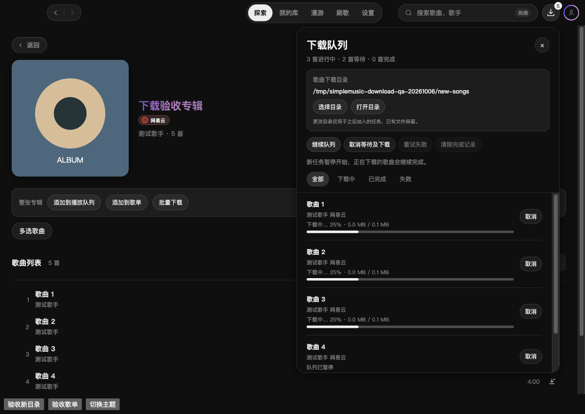
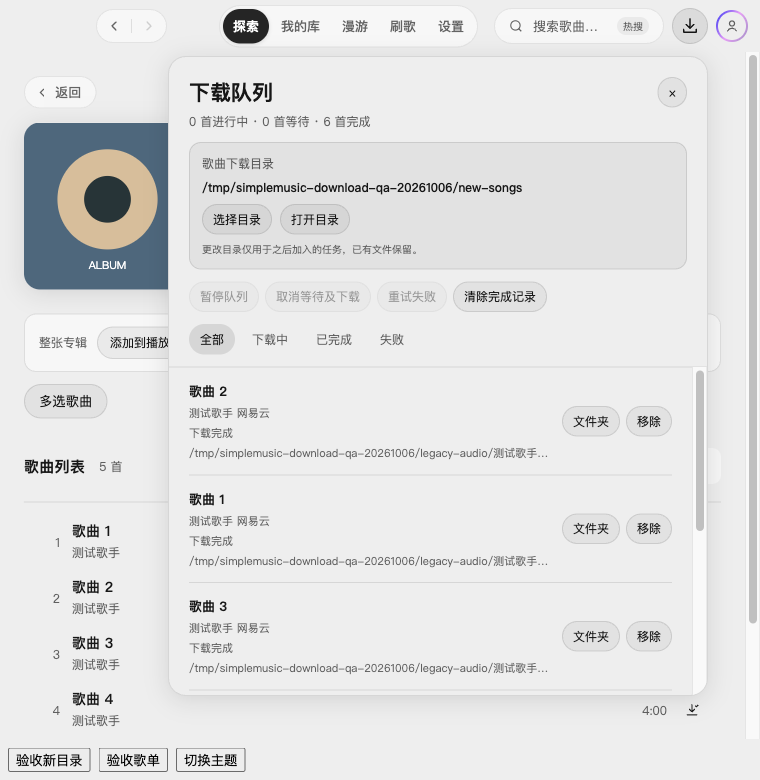

# 2.3.1 下载队列与目录验收

日期：2026-10-06。延续 `feature/library-actions-2.3.1`，目标 `dev/2.3.1`；在同一独立 worktree 实施。用户授权本地提交并 Squash 合入 `dev/2.3.1`，原工作区未提交内容保留，不推送或发布。

## 用户可用行为

- 顶栏常驻下载队列入口，可随时查看等待、下载、写入文件、完成及失败任务；显示字节进度，支持暂停/继续队列、单项或全部取消、失败重试、筛选和清除完成记录。关闭面板不影响下载，完成记录不自动消失，历史最多 100 条；当前运行期间保留队列，不提供重启恢复或断点续传。暂停阻止新任务起步，正在下载的歌曲继续完成。
- 搜索结果、专辑和歌单支持批量下载；详情可下载整个集合，或多选歌曲后下载。歌单未加载的曲目在执行任务时补全详情。网易云与 QQ 使用现有可下载音源解析，Apple Music 和本地文件不进入在线下载。
- 队列面板提供选择和打开下载目录，设置的“缓存与下载”提供管理入口。歌曲保存为 `歌手 - 歌曲名` 和实际音频扩展名；同名文件自动加序号，不覆盖用户文件。完整缓存直接复制导出，避免重复联网下载。
- 升级保持原缓存配置及原音频文件。首次下载目录从用户现有 `audio-cache-config.json` 对应目录读取，再独立保存至 `song-downloads.json`；之后修改下载目录不改缓存配置、不搬移或清理旧文件。任务入队时固定目标目录，改目录只作用于新任务。导出文件即使与缓存共用文件夹，也不会被播放器的缓存清理删除。

## 实现及边界

下载队列延续 `stores/offline-cache.ts` 三首并发；导出阶段也占用并发槽。任务独立取消，进度响应在任务取消或切换候选后失效。批量入队在异步目录回查后再次核对取消信号和队列版本；旧目录请求失败不能覆盖新目录。

`server/lib/song-downloads.ts` 仅从缓存索引核验歌曲归属后读取音频；临时文件复制完整后发布，文件名清理路径与非法字符，目录须为绝对路径。同名发布不覆盖；支持硬链接的文件系统使用原子发布，不支持时使用 `COPYFILE_EXCL` 复制完整临时文件。任务取消清理本次文件并释放缓存读锁。所有端点沿用本地 API 的 Origin/token 校验。目录打开经明确 IPC 契约，只接受存在的绝对目录。

## 验证

- 类型检查、全量 189 个文件 / 1,523 项测试、`git diff --check` 与独立复审通过；未执行生产构建或安装包构建。
- 回归覆盖旧自定义缓存路径继承、首次默认路径固定、换下载目录不改缓存配置、缓存清理保留导出文件、同名并发不覆盖、格式识别与路径字符、歌曲归属、取消与读锁释放；暂停/继续、批量去重、目录快照、导出失败复用缓存、歌单占位详情补全、慢目录请求取消及旧错误隔离。
- 隔离 macOS Electron 开发窗口使用真实本地 API 与受控音频响应：验证常驻入口、三首并发和字节进度、暂停后两首等待、继续执行、关闭重开保留完成记录、改目录后旧等待任务保留原路径、歌单多选两首下载并单项取消。7 个歌曲文件实际落盘，逐一核对 `.mp3` 名称、65,536 字节及文件头；原缓存配置未变化。深浅主题与 760px 窄窗口面板无越界。
- 原生目录选择复用现有桥接；真实账号的在线音频、Windows、外置盘的文件系统回退与正式安装包仍需对应环境实测。测试用户目录与真实账号目录隔离，未读取真实凭据。

## 截图

受控数据及底部验收按钮仅用于验证，不属于产品功能。

