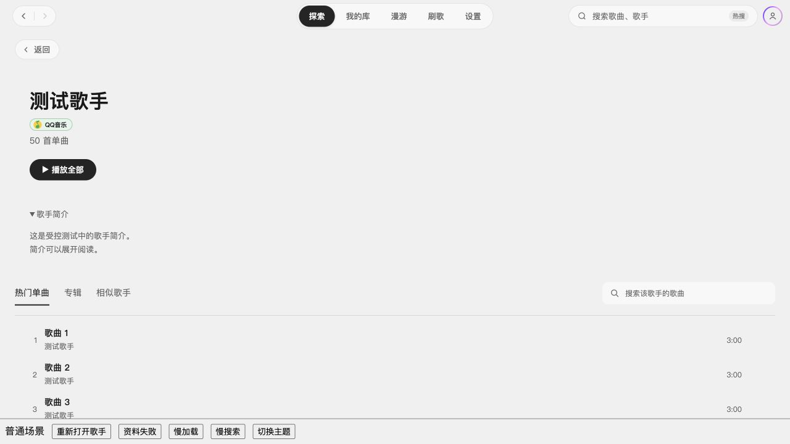
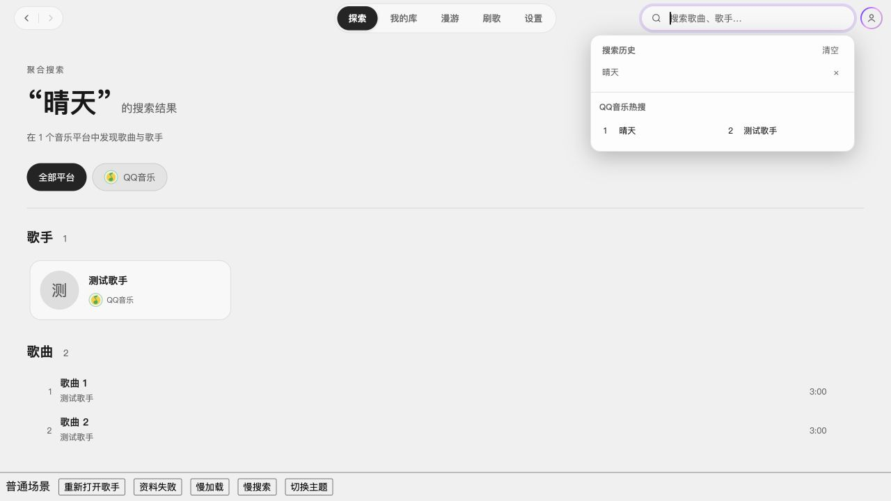

# 2.3.1 GitHub Issues 代码任务

日期：2026-10-05。目标集成分支：`dev/2.3.1`；工作分支：`feature/issues-2.3.1`，基于 `9d50c16` 创建。原工作区未提交改动保留，本任务在独立 worktree 实施。

## 优先级与版本范围

| 优先级 | Issue | 2.3.1 范围 |
|---|---|---|
| P1 | [#25 QQ 自建歌单加载失败](https://github.com/Yyyangshenghao/simple-music/issues/25) | 修正普通歌单上游参数类型，恢复曲目加载路径 |
| P2 | [#23 二级界面返回状态](https://github.com/Yyyangshenghao/simple-music/issues/23) | 从专辑返回歌手页时恢复标签、搜索词和滚动位置，前进同样保留 |
| P3 | [#24 功能建议](https://github.com/Yyyangshenghao/simple-music/issues/24) | 按用户确认补搜索历史、网易云与 QQ 歌手简介及网易云专辑简介；搜索专辑/歌单与批量操作延期 |

## 根因与实现边界

- QQ `CgiGetDiss` 接收 JSON 数字 `disstid`，原实现传字符串。同一公开歌单匿名只读请求对比：字符串返回业务码 `-100008` / `param error`，数字成功；推荐歌单总数 675、自建公开歌单总数 40。修正数字转换并拒绝非正安全整数 ID，保留“我喜欢”和榜单专用分支、分页顺序。不迁移接口、不改歌单 ID 映射。参数类型参照 [QQMusicApi 当前歌单实现](https://github.com/L-1124/QQMusicApi/blob/main/qqmusic_api/modules/songlist.py)。
- 导航历史增加歌手页状态快照；当前滚动状态独立于路由引用，避免滚动唤醒整个应用。恢复等待资料请求和当前标签加载结束，资料请求失败也能完成恢复；用户修改搜索、标签或主动滚动会取消旧位置恢复。快速离开尚未加载的页面仍保留待恢复的位置。
- 顶栏复用现有搜索历史存储：最多 15 条、去重置顶，明确提交或选择结果后记录，支持点击再次搜索、单条删除和清空。
- QQ 简介复用已接入歌手详情的 `data.singer_brief`，公开 MID 匿名请求确认该字段存在；网易云歌手保留 `briefDesc`。网易云专辑元信息复用现有 `album/songs` 响应，缺失时保留摘要。QQ/Apple 专辑沿用现有简介。简介按纯文本展示，缺失时不显示歌手展开入口。

## 验收

- 回归用例覆盖 QQ 数字参数、非法 ID、原分页及虚拟歌单分支，歌手页历史/前进状态与过期来源隔离，简介字段与文本转义，网易云专辑元信息及缺失回退。
- 类型检查、全量 180 个文件 / 1,449 项测试及 `git diff --check` 通过。
- 隔离开发页面验证：专辑标签返回及前进后再次返回、滚动位置恢复、歌手资料失败、慢加载恢复与主动换标签、搜索历史提交/刷新/再次搜索/置顶/删除/清空、歌手及专辑简介、深浅主题。测试使用受控目录数据及独立测试环境，不读取真实账号凭据。
- 独立复审发现的资料失败、取消恢复后保存旧位置、页内快速返回误取消恢复问题均已修正。
- 未使用真实 QQ 私有歌单登录态或音频播放验收；未验证 Windows 或正式安装包。用户追加授权提交并通过 feature PR 合入 `dev/2.3.1`，不包含版本发布或关闭 Issue。

## 页面验证截图

以下为隔离开发页面的受控测试数据，底部按钮仅用于验收，不属于产品界面。

