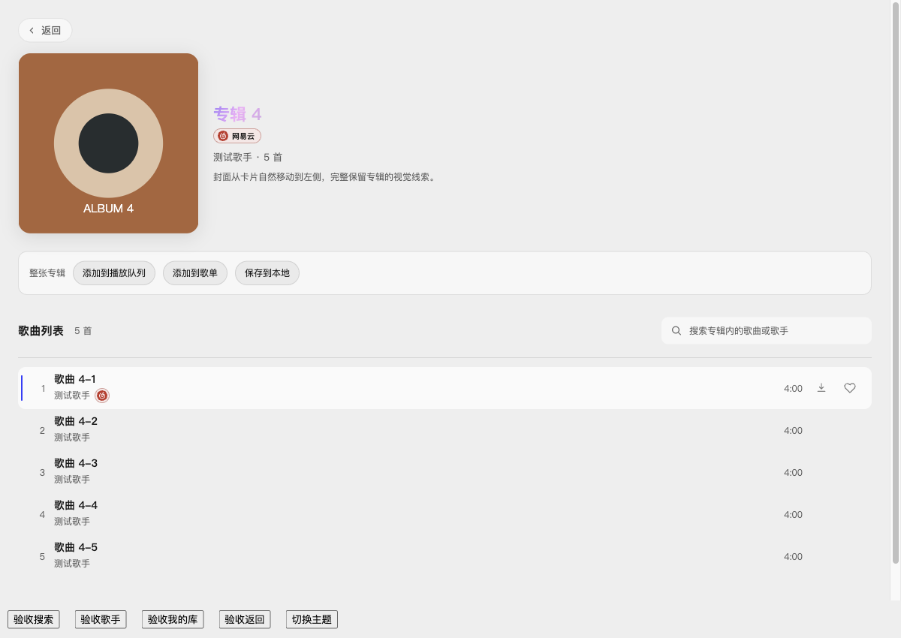
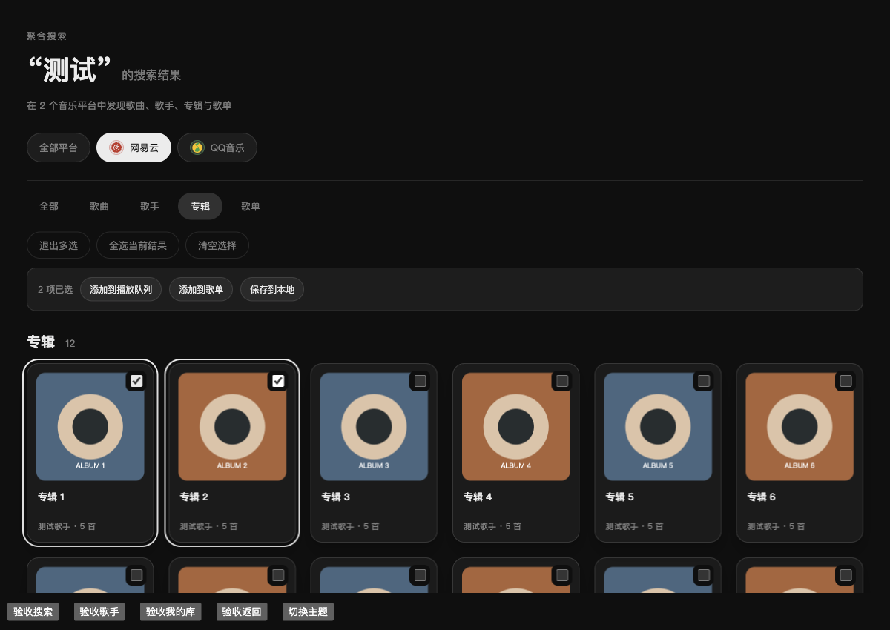
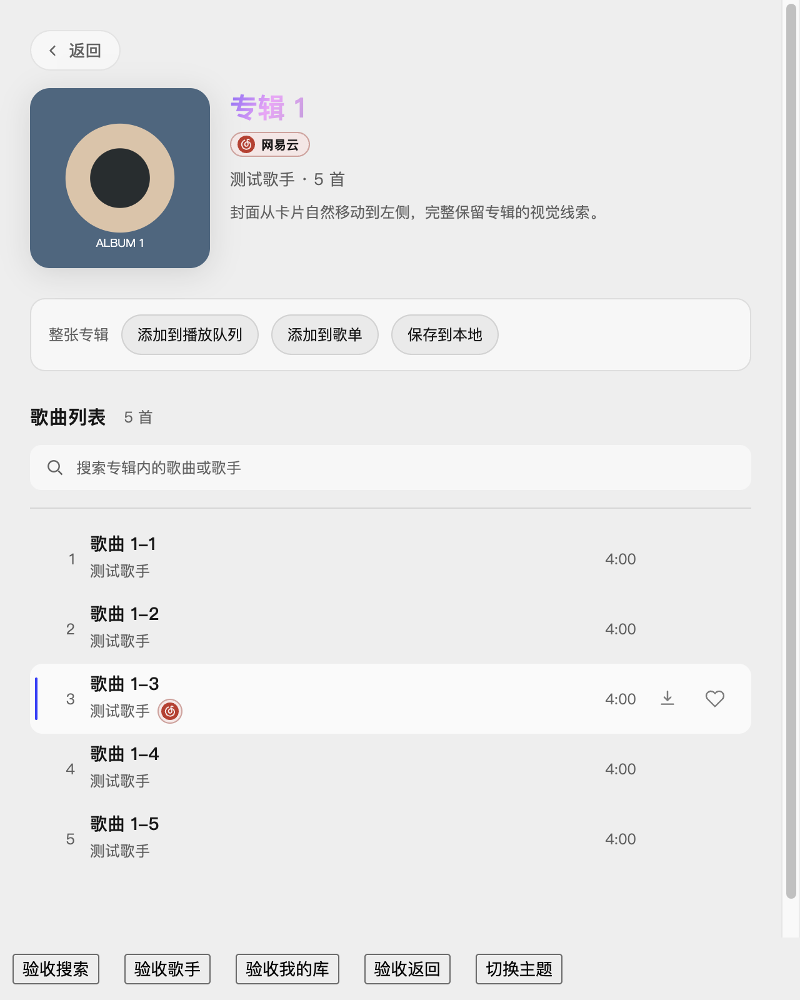

# 2.3.1 专辑、搜索与批量操作验收

日期：2026-10-06。目标集成分支：`dev/2.3.1`；工作分支：`feature/library-actions-2.3.1`，基于 `b8addde` 创建。原工作区已有 QQ 客户端及文档改动，本任务在独立 worktree 实施。用户授权将本次实现提交并本地 Squash 合入 `dev/2.3.1`，保留原工作区未提交内容，不推送或发布。

后续补充：本地保存已扩展为常驻下载队列与独立歌曲文件目录，歌单也支持批量下载；最新范围和验收见 [下载队列与目录验收](2.3.1-download-queue.md)。下文保留本轮验收记录。

范围调整（2026-10-06）：用户确认 2.3.1 撤销本轮新增的批量平台歌单写入，聚合歌单仅记录概念、留待 2.4.0 实现。已移除添加到歌单入口、目标选择器、`addPlaylistTracks` 新能力及 `writable` 标识，保留批量播放队列与下载；既有漫游平台歌单功能保留。下文关于本人歌单选择、确认和写入的验收及截图为调整前历史，不代表当前可用功能。 本次调整通过类型检查、189 个文件 / 1,522 项测试及独立复审；隔离开发窗口验证入口移除、歌单展开与队列去重、批量下载入队，平台歌单写入请求为零。

## 实现范围

- 本地保存从单个任务改为三首并发队列，超出自动等待；同来源/ID 的活跃任务去重，支持逐首或全部取消、失败重试。完成历史最多保留 20 条，优先保留失败项，所有活跃任务不参与历史裁剪。Apple Music 受保护音频不进入保存队列。
- 专辑详情封面最大 240px，窄窗口自适应；专辑曲目及加载骨架去除重复封面，普通歌单沿用原曲目展示。封面通过统一专辑身份和共享元素弹簧转场，从搜索、歌手或我的库卡片移动到详情左侧；滚动容器参与坐标计算，首次专辑详情直接挂载，避免异步页面模块打断转场。动效实现参考 [Motion 共享布局动画](https://motion.dev/docs/react-layout-animations)。
- 补齐 [GitHub #24](https://github.com/Yyyangshenghao/simple-music/issues/24) 的专辑/歌单搜索：网易云、QQ 和 Apple Music 提供独立分类结果及来源筛选，单类失败不阻断其他类别；账号、平台或关键词变化后丢弃迟到结果。搜索历史和简介沿用前一任务实现。
- 搜索页支持歌曲、专辑及歌单多选，按显示顺序展开集合并去重后追加播放队列，保留当前播放位置和随机顺序；专辑详情提供整张专辑操作。歌曲与专辑可批量保存网易/QQ 可下载曲目。
- 加入歌单仅显示同来源且本人可写的网易云歌单。复用追加接口，提交前核对来源、账号及歌单所有权，排除收藏和特殊歌单；服务端再次核对 Cookie 会话和所有者。提交后完成写入并失效歌单缓存，不使用替换接口覆盖原歌单。

## 验证结果

- `npm run typecheck`、全量 187 个文件 / 1,506 项测试及 `git diff --check` 通过。没有执行生产构建或安装包构建。
- 回归覆盖三首并发与补位、活跃任务去重、取消及迟到响应、失败历史保留；多来源队列去重、播放位置及随机顺序保留；集合展开顺序、账号变化和取消；分类字段映射、Apple 歌单未知曲目数、网易歌单归属及写入前会话变化。
- 网易云和 QQ 的专辑/歌单搜索上游已做匿名只读请求，核对结果类型及字段。实际在线服务可用性仍依赖平台响应。
- 通过隔离的 macOS Electron 开发窗口验证搜索过滤、多选两张专辑追加 10 首而不开始播放、本人歌单选择及确认流程、迟到关键词响应丢弃、歌手和我的库专辑标签返回、深浅主题、640px 窄窗口和减少动态效果设置。
- 动画过程采样确认封面从卡片坐标连续移动并放大到详情左侧；专辑列表 5 行均无封面。受控保存请求记录最高并发为 3，5 首整专辑保存显示 3 首进行中 / 2 首等待，逐首及全部取消通过。
- 独立复审提出的我的库返回标签、写入提交后的缓存失效及并发新失败记录裁剪问题已修复；最终复核未发现剩余具体阻断。

## 验证边界

界面验收使用受控目录和写入响应、独立测试用户目录，未读取真实账号凭据或向真实歌单写入。真实账号歌单追加、实际音频保存、Apple Music DRM、Windows 和正式安装包仍需对应环境实测。QQ/Apple 暂未提供歌单追加能力，界面不显示不具备能力的目标；跨来源曲目不能直接写入网易云歌单。

## 页面截图

以下为受控测试数据，底部按钮仅用于验收，不属于产品界面。

