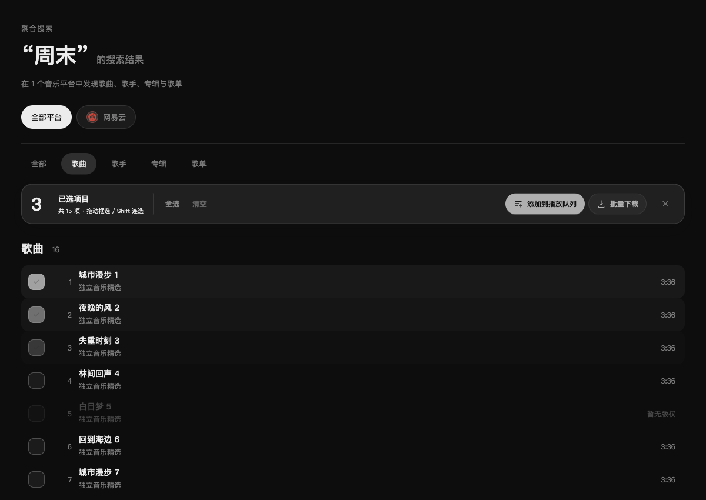
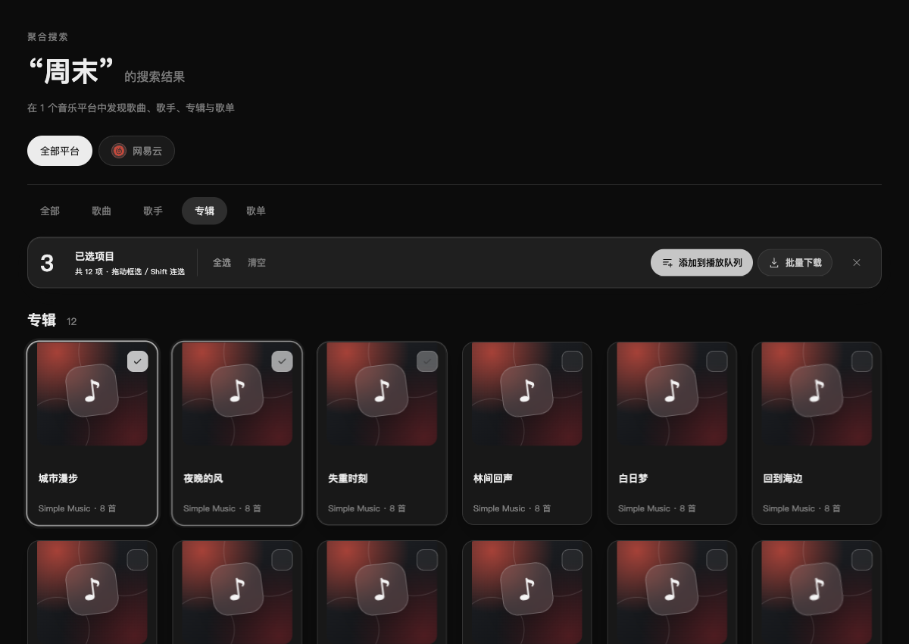
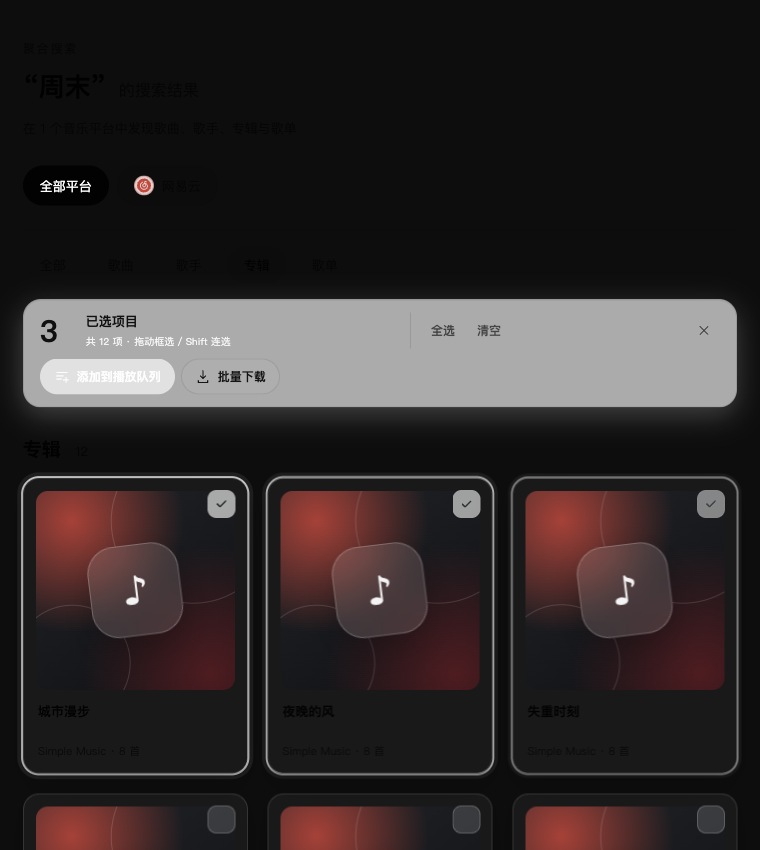

# 2.3.1 多选样式与交互验收

日期：2026-10-06。工作分支 `feature/selection-interaction`，目标 `dev/2.3.1`。用户要求优化多选样式与鼠标拖动体验，并本地集成供测试；原主目录的未提交 QQ 文件在独立 worktree 外保留。

## 行为

- 搜索中的歌曲、专辑、歌单及专辑/歌单详情统一勾选、选中高亮和吸顶玻璃操作栏；选中数量、全选、清空、加入播放队列、批量下载及退出集中显示。窄窗口操作按钮换行。
- 进入多选后，鼠标左键拖动超过 6px 开始框选，向上/下拖动均可选；垂直拖动也有效，靠近滚动区域边缘时自动滚动。鼠标松手、Esc、失去焦点、切换页面/账号/搜索范围后停止拖动和滚动。
- 单击切换选择，Shift 按当前显示顺序连选；⌘/Ctrl 拖动反选、Shift 拖动追加。⌘/Ctrl+A 全选可用项目，Esc 退出。输入框中的全选保留文字编辑行为。
- 不可用歌曲不参与选择；详情虚拟列表按完整行坐标选取，尚未挂载的行同样可以被框选。平台及账号变化清空旧选区。
- 多选时单曲红心与下载入口隐藏，卡片暂停倾斜，避免键盘误写平台状态或拖动误播放。批量操作仍仅追加播放队列或下载，不写入第三方平台歌单；2.4.0 聚合歌单仅记录概念。

## 验证

- 类型检查、190 个文件 / 1,526 项测试及 `git diff --check` 通过。没有生产构建或安装包构建。
- 单测覆盖正反向矩形与接触边缘、虚拟行边界、连选锚点与过滤、基于拖动快照的替换/追加/反选。
- 隔离 macOS Electron 开发窗口使用受控搜索结果和 180 首详情：Space 勾选、Shift 连选、快捷键全选、垂直拖动、网格框选、⌘ 追加、深浅主题及 760px 窄窗口通过；边缘滚动框选 32 首，含未挂载行。全选排除 1 首不可用歌曲，过滤后 30 首下载入队。
- 同平台更换账号清空选择，中途换账号或 Esc 停止框选；框选结束立即操作工具栏正常；挂载实际本地快捷键处理后，容器聚焦的空格键未触发播放/暂停。未触发平台写入，未误开始播放。
- 独立复审发现的键盘红心、合成点击及账号会话边界已修正；最终复核通过。
- Windows 原生鼠标与正式安装包未实测。测试不读取真实账号凭据，不向真实平台写入，下载入队使用暂停队列与独立测试目录。

## 截图

截图使用受控数据，不含真实账号信息。

