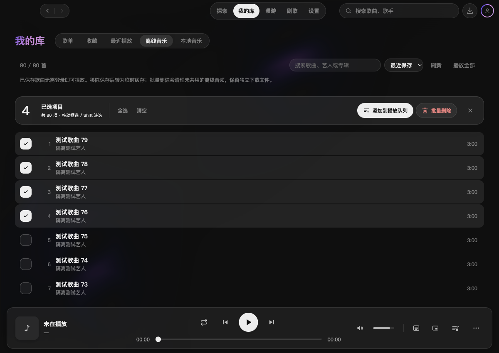
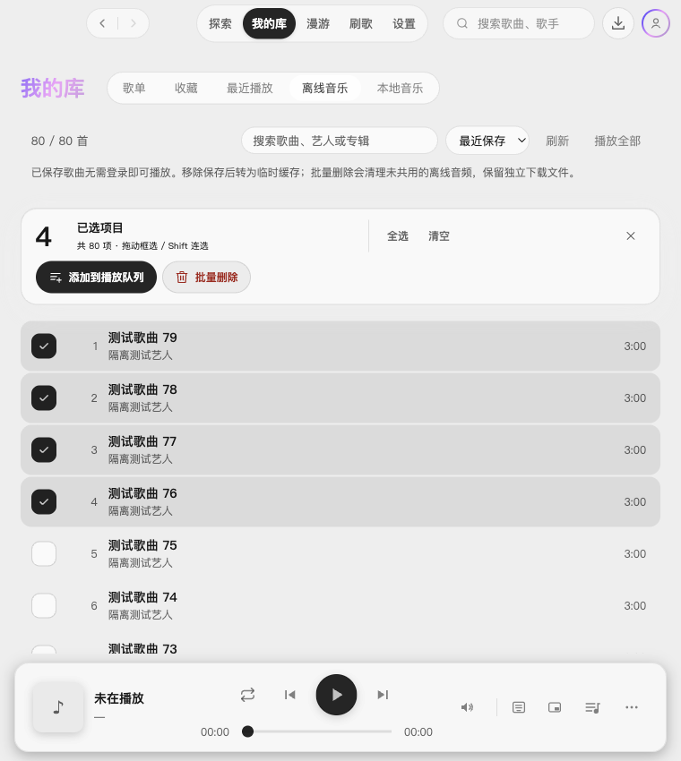

# 2.3.1 离线音乐批量删除验收

日期：2026-10-07。工作分支 `feature/offline-batch-delete`，目标 `dev/2.3.1`。

## 行为与数据边界

- 离线音乐的“更多”菜单提供追加播放队列、进入多选；复用 2.3.1 的勾选、框选、虚拟列表边缘滚动、Shift 连选、全选、清空与 Esc 退出。
- 多选操作栏新增“批量删除”，先确认删除数量与文件保留范围。只处理所选保存快照；顺序请求，部分失败继续，取消或退出后停止后续请求，最终回查真实列表。失败项保留供重试。
- 以来源、曲目 ID、缓存索引 ID 和保存时间校验归属；重新保存后的旧快照拒绝删除。其他主动保存的歌曲共用音频时仅取消所选保存；最后一个保存才物理删除，并拒绝删除正在读写的文件。独立下载目录及与缓存同目录的导出歌曲文件均不受影响。
- 单曲“移除保存”继续转为临时缓存，页面提示说明两种操作的差异。离线网易/QQ 追加播放队列无需登录，不打断当前播放；在线批量操作和 Apple Music 的原限制保留。

## 验证

- 功能分支类型检查、191 个文件 / 1,546 项测试和 `git diff --check` 通过；独立复审及新增入队逻辑复核通过。合入 `dev/2.3.1` 时保留搜索页的浮动操作栏，集成后类型检查、192 个文件 / 1,549 项测试与独立复核通过。
- 回归测试覆盖跨源同 ID、共享文件与最后引用、导出文件保留、token 与归属校验、保存时间过期、读/写租约、去重、部分失败、取消与请求中止，以及离线入队和 Apple 限制。
- 隔离 macOS Electron 开发窗口用 82 首受控曲目验收：Space 勾选、Shift 连选、快捷键全选、筛选重置、鼠标框选与边缘滚动（75 首，含未挂载行）、确认取消、部分失败保留选区、共享歌曲逐项删除、取消请求与 Esc 停止后续删除、未登录追加队列且未开始播放均通过。
- 深色 1200px 与浅色 760px 视口布局检查通过；未出现渲染错误。测试使用临时用户数据、缓存及音乐目录，未读取或修改真实歌曲。
- Windows 原生交互及正式安装包未实测；本轮仅运行开发窗口，未构建安装包。

## 截图

