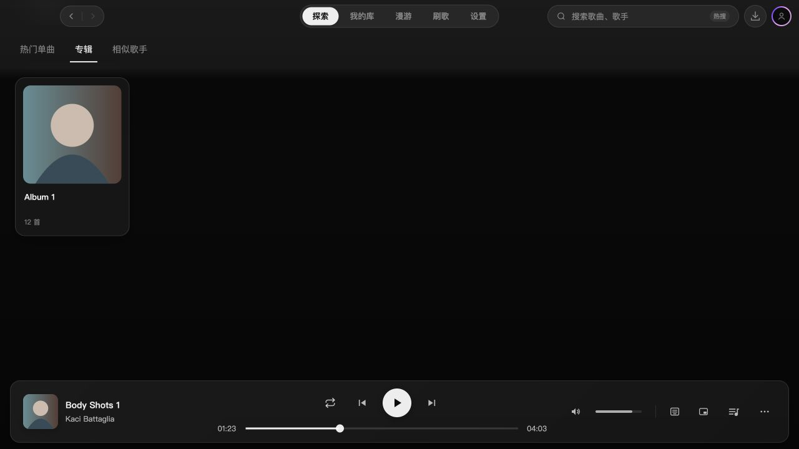

# 2.3.4 歌手分类点击平滑定位验收

基于 `a0a2a5f`，目标 `dev/2.3.4`；仅集成，不发布。

## 行为

点击分类立即切到目标内容，先完成 180ms 横向过渡，再在目标分类中平滑定位。热门单曲、专辑对齐列表开头，分类位于顶栏下方；相似歌手回到页面顶部。再次点击当前分类只进行定位；减少动画时直接切换、直接定位。

切换期间暂存旧内容高度，避免短列表先裁剪滚动位置。定位开始前补足目标所需的最低空间；结束或中断时只保留当前位置所需的最低高度，用户上滚时继续缩小，到页面顶部完全释放。仅一张专辑也能吸顶；短相似歌手回到顶部后没有多余滚动条。

用户滚轮、触摸、滚动条拖动、键盘滚动或修改搜索条件可取消自动定位，已切换的分类保持选中。快速改选以最后一次为准，离开页面清理监听。横向动画仅接收自身结束事件；垂直结束事件必须达到目标位置才释放空间。等待歌手资料和目标数据就绪后重新计算坐标，保留搜索加载首帧的竞态保护。

## 验证

开发模式使用真实 AppShell、ArtistPage、ArtistToolbar、顶栏和播放栏，挂载合成 QQ 数据（50 首歌曲、20 张或一张专辑、一位相似歌手）。通过界面点击并逐绘制帧记录分类、横向变换、滚动位置和暂存高度；临时页面提交前移除。

- 1280 × 720：长歌曲列表切专辑，首帧已是专辑，仍在约1172px；约218ms后才开始垂直滚动，最终330.5px，分类位于52.09px。80个不同位置，没有先滚旧列表。
- 长歌曲切相似歌手：首帧已是相似歌手且横向偏移18px；约204ms后开始垂直滚动，最终0，额外高度完全释放、最大滚动距离0。
- 短相似顶部切单张专辑：首帧专辑、横向偏移-18px、scrollTop仍为0；约220ms后开始垂直定位，最终330.5px，50个中间位置，没有结束后的二次裁剪。
- 减少动画模式、连续专辑/相似改选、滚轮中断（相似保持选中且停在1150px）、保留Body搜索并延迟完成请求均检查；搜索结果回来后分类对齐52.09px。
- 独立复审发现短列表释放与目标范围不足两处边界，修复后复核通过；9项定位/空间回归用例通过。最终类型检查与全量198个文件、1633项测试通过。

Windows触控板和原生窗口效果未实机复测。

