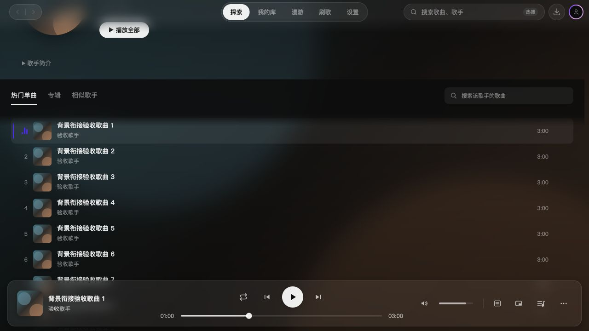
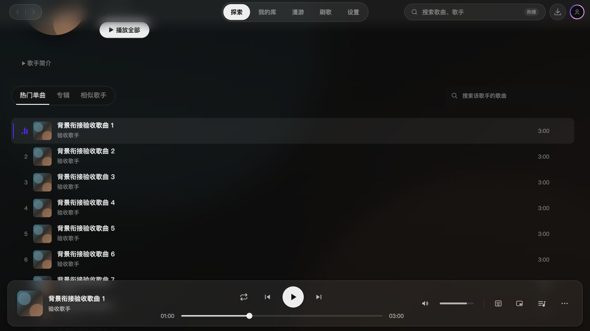
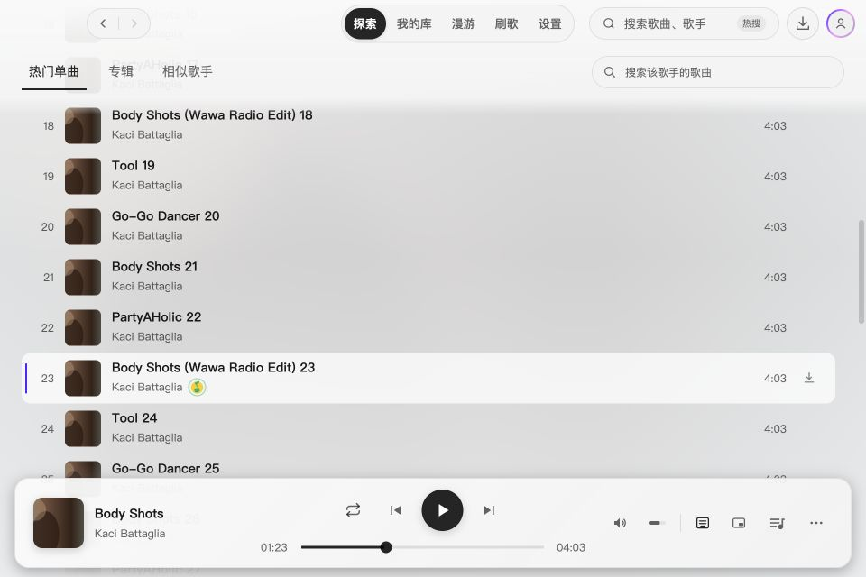
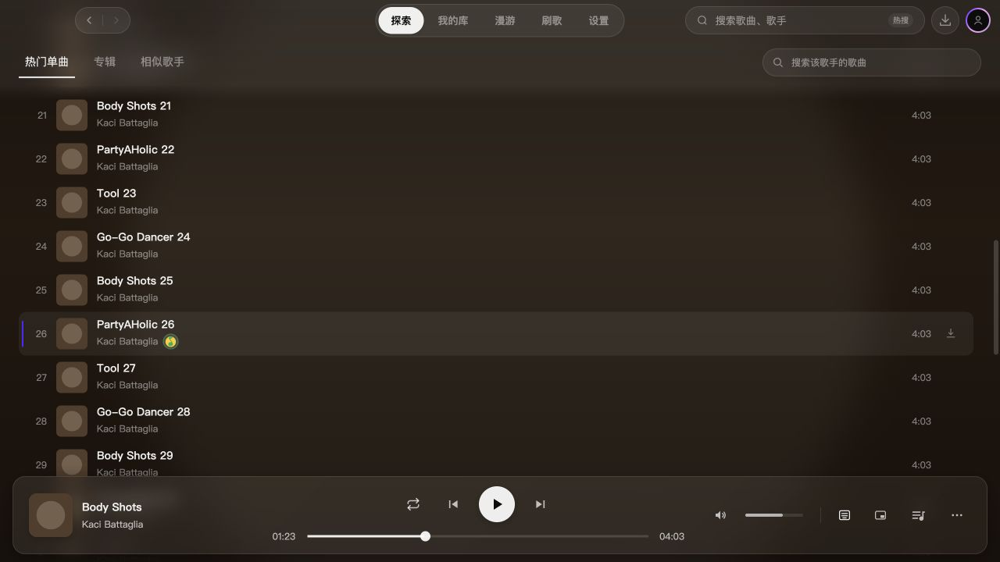

# 2.3.4 歌手分类栏与顶部导航衔接验收

目标 `dev/2.3.4`，基于 `ffb54b8`。分类标签与搜索框原先各有深色胶囊背景，滚动后与顶部导航割裂。本轮仅集成修正，暂不发布。

## 修正

移除标签组的独立背景；分类栏吸顶后与主导航共用一张玻璃背景，下缘渐隐到歌曲列表。搜索框沿用顶栏的轻玻璃与圆角。吸顶前保留封面氛围，不提前铺背景。

分类控件始终挂载在同一根层，避开页面渐隐蒙版对背景模糊的限制；占位保留在原滚动区，位置通过原生滚动时间线同步；资料加载、简介展开及窗口尺寸变化只更新初始位置和吸顶距离。无溢出列表退出滚动动画，避免保留上一次吸顶的位置。滚轮转交原页面并取消待执行的历史位置恢复，输入框跨吸顶状态保持焦点和值。退出歌手页立即移除控件层，恢复普通顶栏背景。其他搜索页面继续使用原默认样式。

## 验证

- 开发模式挂载真实 AppShell、歌手页、顶栏与播放栏；使用合成 QQ 歌手、50 首歌曲、20 张专辑、15 位相似歌手与本地 SVG 封面。
- 1280 × 720 深色界面：滚轮在搜索框上操作后分类栏吸顶到 52px；输入值 `Body`、焦点与根容器位置保持不变。
- 展开足够长的简介后分类栏位于屏幕外；用真实 Tab 聚焦搜索框，原页面滚动到可见位置，根容器 `scrollTop` 仍为 0，分类栏回到 52px。
- 延迟搜索结果加载：在控件上滚动后完成搜索，原页面保持 0；没有用户滚动时仍正常恢复历史 900px，避免加载完成覆盖用户意图。
- 专辑、相似歌手切换正常；后退退出歌手页后控件层数量为 0，顶栏背景恢复。
- 960 × 640 浅色与减少透明度设置：分类和搜索正常排列，玻璃模糊为 `blur(0px)`；截图见下。
- 独立复审指出滚轮未取消历史位置恢复的问题，已修复；后续复核未发现阻塞问题。
- 最终类型检查通过；全量测试 197 个文件、1624 项通过（受限环境的本地 HTTP 用例超时后，在允许启动本机服务的环境重跑通过）。Windows 原生合成与窗口拖动仍需实机确认；合成数据检查不代表在线资料请求或真实播放已验收。

修改前：

修改后：

## 上下滚动稳定性回归（基于 c2e5642）

旧实现先在 scroll 事件中安排 requestAnimationFrame，再读取 sticky 占位的位置并写回根层控件的 top。控件跟随脚本更新，滚动过程中会晚一帧。改为正常流占位、根层原生滚动时间线和 transform；在吸顶距离内与页面等速移动，超过距离后固定在 52px。滚动事件只切换玻璃背景状态，布局测量仅在资料或尺寸变化时进行。

开发模式使用真实 ScrollArea、ArtistToolbar、TrackSearch、顶栏和播放栏，通过临时界面按钮驱动平滑滚动，在每个 requestAnimationFrame 读取可见控件位置，对照 `max(52, 初始位置 - scrollTop)`：

- 初始位置 382px，依次滚到 150、500、250、700、0px，每段间隔 600ms；同一采样方法下旧实现 360 帧最大误差 30.5px，新实现最大误差 0px。scroll 事件内部的旧实现采样最大误差另为 28px；绘制帧结果用于最终判断。
- 无溢出内容停在初始 382px；最大滚动 193px、不足 330px 吸顶距离时，控件位置为 189px，未提前吸顶。
- 简介展开后初始位置 1252px，聚焦屏幕外搜索框后原页面滚到 1200px、控件回到 52px、根容器 scrollTop=0；深滚到 2640px 后移出并重新聚焦，滚动位置保持 2640px。
- 完整 AppShell + ArtistPage 合成数据检查：歌曲列表滚到 1440px 后控件固定 52px；切换只有一位相似歌手的无溢出列表恢复初始 382.59px，动画名称为 none。已修复失活时间线保留最后一帧的问题。
- CSS 使用分项动画属性，避免现有 CSS Modules 将 shorthand 中的 auto 错认成动画名称。最终独立复审未发现问题，类型检查及 197 个文件、1624 项测试通过；Windows 原生触控板/窗口合成仍未实机复测。

原生滚动时间线和跨层作用域依据 [Chrome 官方说明](https://developer.chrome.com/docs/css-ui/scroll-driven-animations)。960 × 640 浅色窗口吸顶仍为 52px；退出歌手页后控件层和显式滚动时间线数量均为 0。本项目使用固定 Electron 运行时；临时诊断页面在提交前移除，不进入产品。

