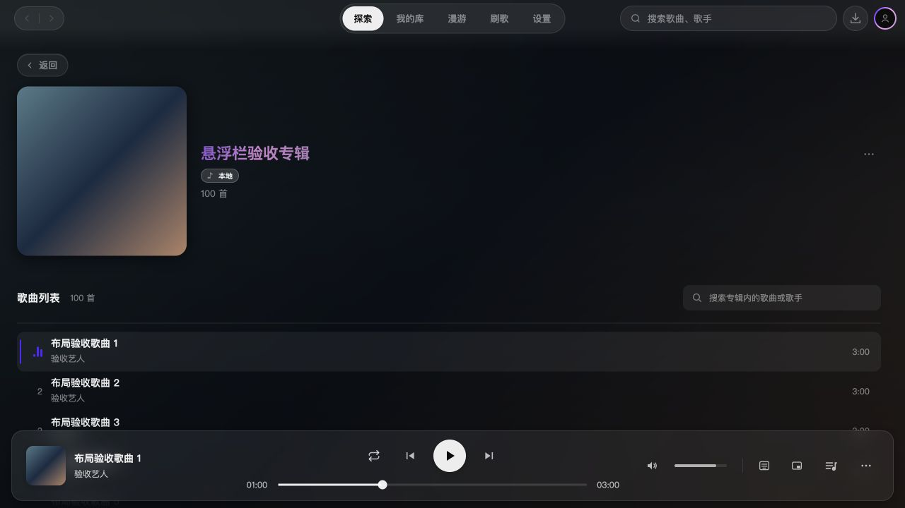

# 2.3.4 页面与悬浮控制栏衔接验收

对应 [Issue #32](https://github.com/Yyyangshenghao/simple-music/issues/32)，目标分支 `dev/2.3.4`，基于已发布的 `v2.3.3`（`da4db22`）。本轮只集成修复，版本元数据仍为 2.3.3，暂不合入 master、打标签或发布。

## 改动与复核

页面视口从顶栏与播放栏之间扩展到整窗，背景贯穿上下控制区。顶栏增加渐隐玻璃层，播放栏保留悬浮圆角面板；页面边缘使用内容遮罩和滚动留白，替代叠加实色的横向渐变条。

同步调整吸顶栏、设置章节导航和刷歌卡片的顶栏避让。独立复审发现框选边缘和歌单预览弹窗受到新视口影响，已分别改为可见安全区自动滚动/裁剪，以及 body portal。复审确认两项修正完成，未发现新的明确合入阻塞。

## 验证记录

- `npm run typecheck` 通过；全量 `npm test`：196 个文件、1621 项通过。
- 隔离数据的 macOS `npm run dev` 检查设置、章节导航、更新历史及歌词面板，页面与播放控件可正常显示。
- 本地浏览器使用真实组件及 100 首合成的本地专辑曲目，检查 1280 × 720 深色与 960 × 640 浅色界面。无需登录在线账号；截图不是在线 QQ 专辑的实测记录。
- 页面视口顶边为 0，高度等于窗口；顶栏高 52px，播放栏高 120px，底部安全区为 124px。最大滚动位置的第 100 首歌曲底边为 516px，位于播放栏顶边 600px 之上。
- 深滚动时多选操作栏顶边为 64px；框选靠近可见底边时滚动位置从 2172.5 增至 2180.5，并选中 6 首歌曲。补充可见边缘滚动回归用例。
- 歌单预览遮罩覆盖整窗，父节点为 body，自身不继承页面 mask，关闭正常。
- macOS 原生拖窗自动化未得到可靠的移动结果，且收尾时电脑锁屏；该项仍需人工确认。Windows 的背景合成、控件操作与拖窗尚未实机复测，浏览器检查不替代 Electron 平台验收。

## 界面证据

Issue 保留打开，等待实机视觉确认；后续收到发布授权再统一版本号与发行说明。
