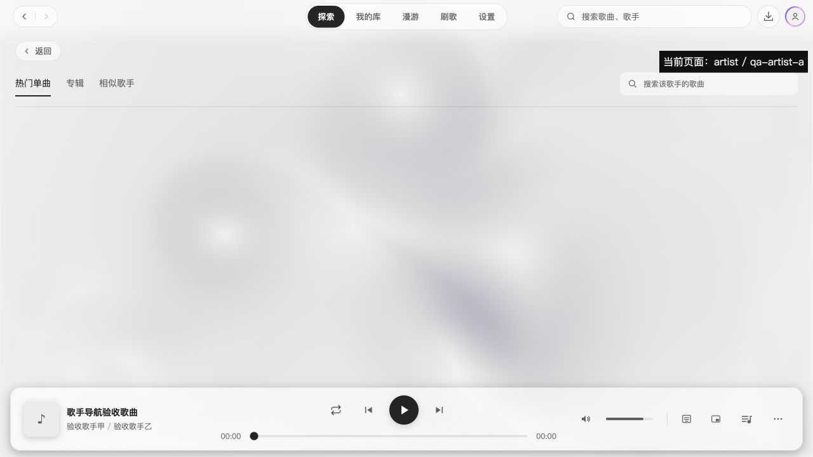

# 2.3.4 歌词界面播放栏歌手跳转验收

用户报告：歌词界面点击底部播放栏的歌手看似无法跳转，但点击大封面下的歌手会收起歌词并进入歌手页。目标分支 `dev/2.3.4`，基于 `4fac461`，本轮暂不发布。

## 根因与修正

播放栏已经调用页面导航，但未收起 App 中的歌词浮层，目标页面被遮住。大封面下的歌手链接通过 `ArtistLinks.onBeforeNavigate` 先执行关闭回调。

App 现在把同一关闭动作通过 PlayerBar、TrackInfo 传给 ArtistLinks；仅点击有效在线歌手时关闭歌词，再按实际点击的歌手 ID 和曲目来源跳转。本地曲目与缺少 ID 的歌手仍为纯文字，播放控制和封面打开歌词行为保持原样。

## 验证

- 先写回归测试，修改前因未调用关闭回调失败；修正后通过。用例覆盖合作歌手选择及关闭/导航顺序、普通页面导航、本地与缺 ID 的歌手不操作。
- `npm run typecheck` 通过；全量测试 197 个文件、1624 项通过。
- 开发模式运行，并在本地浏览器挂载真实 App，以合成 QQ 曲目从设置页打开普通歌词。点击播放栏第二位歌手后，可见导航状态为 `artist / qa-artist-b`，歌词浮层移除打开状态且 `pointer-events: none`。
- 再打开歌词，点击大封面下第一位歌手，同样收起歌词并导航到 `artist / qa-artist-a`。合成 ID 用于验证导航，未验证在线歌手资料请求；未使用在线账号。
- 独立复审未发现阻塞问题。Windows 原生界面未在本轮实机复测。

