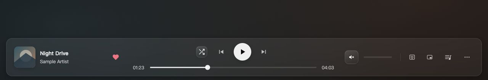
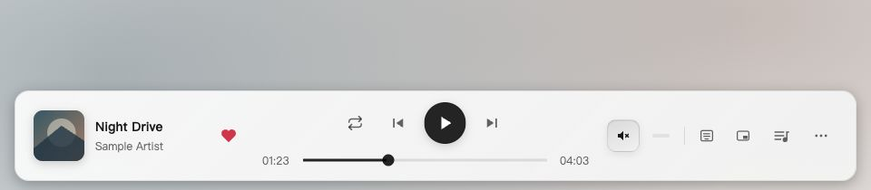

# 2.3.4 播放栏按钮悬停效果验收

目标 `dev/2.3.4`，基于 `13e76eb`。用户指出播放栏按钮悬停的圆形底色粗糙，与应用玻璃氛围不一致。本轮仅集成样式，暂不发布。

## 改动

普通按钮共用圆角玻璃高光：细描边、斜向渐变和柔和边缘光，移入时渐显并轻微舒展，移出时收起。高光使用独立伪元素，不拦截鼠标，也不争用现有 Motion 按压缩放。没有新增背景模糊或持续运行的动画。

中央播放键保留主按钮层级，悬停增加柔和外缘光。红心保留红色，随机/单曲模式、桌面歌词、迷你播放条、队列和更多按钮开启后保留玻璃提示；原有按钮尺寸、菜单定位与业务行为不变。

## 验证

- 开发模式挂载真实 PlayerBar，以合成曲目、合成已登录状态、预填红心缓存及本地 SVG 封面验证，未使用真实在线账号。验收入口已移除。
- 1280 × 720 深色界面检查真实鼠标悬停：静音按钮 `:hover` 生效，伪元素透明度为 1；红心悬停颜色为 `rgb(255, 107, 129)`。
- 960 × 640 浅色窄窗口检查减少透明度模式：无横向溢出，普通按钮为 32/36px、圆角 10px，主播放键仍为 46px；新增高光不使用模糊滤镜。
- 列表循环、随机、单曲循环切换正常；桌面歌词、迷你播放条开启后高光可见。队列与更多菜单展开正常；切换 1.25 倍速后关闭菜单，更多按钮仍显示激活高光和 5px 提示点。
- 独立只读复审未发现阻塞问题，检查了 CSS Modules 组合、样式优先级、菜单层叠及减少动画规则。减少动画由局部媒体规则和既有全局规则覆盖，未切换系统动画偏好实测。
- `npm run typecheck` 通过；全量测试 197 个文件、1624 项通过。Windows 原生窗口尚未实机复测；浏览器验收不包含桌面歌词/迷你窗口 IPC 流程。

深色悬停：

浅色窄窗口与减少透明度：

