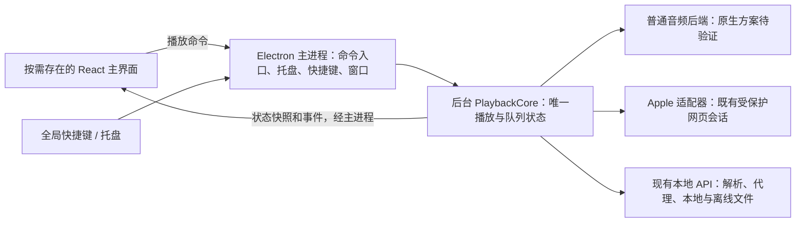

# Simple Music 2.4.0 后台播放与游戏模式架构方案

> 状态：设计草案，尚未实施；产品取舍、代码基准与性能预算待确定。
>
> 目标版本：`2.4.0`；日期：2026-10-05。
>
> 本文基于当前工作区中的 2.3.1 开发实现，包含未提交文件，不等同于已发布版本。现行行为仍以代码和 [播放系统](../playback-system.md) 为准。

## 1. 目标与范围

用户一键进入游戏模式后，音乐和播放队列继续运行，可以使用全局快捷键播放/暂停、上一首、下一首、调节音量；播放器应尽量释放 CPU、内存和 GPU 资源，减少对游戏的影响。返回播放器时恢复界面和当前播放状态。

2.4.0 的核心改动是让播放生命周期独立于主界面生命周期。普通模式和游戏模式共用一个播放会话，切换模式只改变界面和后台工作策略，不交接音频、不重新加载当前曲目、不改变音质。

“不影响游戏性能”需要在指定机器和游戏场景下验收。音频解码、输出、网络和托盘仍有成本，本文不承诺零资源、GPU 进程消失或所有机器上的零帧率影响。

本次不更换整个桌面框架，不重写浏览、搜索和曲库界面，不新增游戏识别、自动切换、模式专属音质或复杂任务调度系统。

## 2. 当前行为与真正的耦合点

| 路径 | 当前工作区行为 | 重构影响 |
|---|---|---|
| `src/lib/audio-engine.ts` | 在主窗口渲染进程创建 `HTMLAudioElement` 和 Web Audio 图 | 主窗口销毁会终止普通音频播放 |
| `src/stores/player.ts`、`playlist.ts` | 持有播放会话、候选解析、队列、走序和自动下一首 | 仅搬音频引擎不能实现无界面连续播放 |
| `src/App.tsx` | 游戏模式返回空界面，顶层 hooks 和音频单例继续运行 | DOM 卸载不等于渲染进程退出或全部内存释放 |
| `electron/modules/game-mode.ts` | 隐藏主窗口、收起迷你条和壁纸 | 目前没有销毁主窗口 |
| `electron/modules/window-manager.ts` | 主窗口设置 `backgroundThrottling: false` | 保留主窗口仍有运行时和后台任务成本 |
| `electron/modules/hotkey-manager.ts` | 主进程注册快捷键，再向主窗口转发动作 | 无主窗口时无法执行播放操作 |
| `src/hooks/useShortcuts.ts` | React 同步绑定；卸载时注销全局快捷键 | 绑定生命周期必须移出 React |
| `electron/modules/tray-manager.ts`、`overlay-manager.ts` | 托盘播放操作经 `triggerMiniPlayerControl` 转发给主窗口 | 托盘也依赖主界面存活 |
| `src/lib/media-session.ts` | 使用主窗口的 `navigator.mediaSession` 提供系统媒体集成 | 销毁 UI 后需要独立替代与实际平台验收 |
| `src/lib/playback-persistence.ts` | 播放状态保存到 localStorage，页面启动时恢复 | 重建 UI 不能用旧磁盘状态覆盖正在运行的后台状态 |
| `electron/main.ts` | 非 macOS 的主窗口 `closed`、`window-all-closed` 会退出应用 | 游戏模式销毁 UI 必须区别于退出应用 |
| Apple Music 播放路径 | 独立受保护网页会话出声，控制与队列仍连接渲染层 | 必须迁移控制归属，保留受保护会话边界 |

因此当前问题不是“音频在主进程播放”，而是普通播放及控制依赖主窗口的渲染进程。现有游戏模式已经停止部分视觉、取色和轮询工作，但没有完成播放与界面的解耦。

## 3. 目标架构

游戏模式下主 UI 可以不存在，后台核心、必要 API 和主进程继续运行。Apple 会话和桌面歌词是否保留，见第 10 节的待定取舍。

### 3.1 主进程：系统入口与生命周期

- 持有托盘、全局快捷键注册、模式状态与窗口创建/销毁职责。
- 播放类操作直接送入统一后台命令入口；打开设置、显示播放器等界面操作才恢复窗口。
- 绑定配置必须在没有 UI 时仍可读取，不能依靠 React effect 保持注册。沿用用户原有启用状态与组合键，不默认开启未启用的快捷键。
- 关闭主 UI、进入游戏模式、后台崩溃、真正退出应用是不同事件；只有明确退出才停止播放、注销快捷键和关闭服务。

### 3.2 PlaybackCore：单一状态所有者

后台拥有当前曲目、播放/暂停意图、实际音源、进度、时长、音量、倍速、队列、随机顺序和当前索引。自然播完、上一首/下一首、播放失败推进、睡眠定时器和已存在的连续播放行为也必须能脱离 UI 执行。

迁移复用现有解析、匹配和队列规则，保留取消信号、播放会话序号和引擎加载序号。UI store 成为后台状态的展示副本，不能与后台各自推进队列或分别恢复播放。

持久化的播放状态由后台统一管理，保存规则仍不存过期直链。升级时一次性迁移既有 localStorage 数据并记录迁移完成；已有后台会话优先于磁盘恢复态。平台参与状态、账户变化和播放偏好以版本化更新同步到后台，退出账号或停用平台后丢弃旧会话的迟到结果。

保持核心职责围绕播放；搜索、列表展示、推荐页面缓存和完整应用 store 不整体搬入后台。刷歌等特殊模式的自动续播规则需单独核对；不能因为 UI 被销毁而停止其已经承诺的连续播放行为。

### 3.3 UI：命令与订阅

- 普通模式创建 UI，发送播放命令，订阅后台状态。
- 进入游戏模式后停止界面订阅，保存必要的导航、窗口与外观恢复信息，再销毁 UI。
- 返回时连接现有后台并获取最新状态；重建界面不得重播当前曲目、重新洗牌、重放旧命令或再次初始化播放持久化。
- 频谱只在普通模式的实际可见可视化需要时启用，使用有界数据通道；游戏模式停止频谱计算、采集和传输。

### 3.4 命令与状态契约

从现有最小操作集合建立契约：播放、暂停、上一首、下一首、seek、音量、队列更新、播放偏好更新，以及获取快照。不要先建设通用消息总线。

同一入口明确命令受理顺序。新切歌请求取消旧解析；暂停等新播放意图不能被旧加载完成覆盖。状态含后台会话标识和递增版本，用于拒绝过期事件；错误以结构化结果传给托盘或恢复后的界面。

UI 重连采用“建立订阅并取得一致快照”的握手，避免取快照期间漏掉切歌或暂停事件。全量队列在连接和队列变化时同步，不随进度广播；没有 UI 或歌词订阅者时不做展示用高频推送。

新增 IPC 继续通过 preload 暴露，并维护 `src/types/ipc.ts` 契约、发送方权限和参数校验。关闭与取消清理订阅，不把 API token、Cookie 或音频直链写入日志。

## 4. 音频后端的选择与验证门槛

| 方案 | 能解决的问题 | 局限与定位 |
|---|---|---|
| 现有主窗口隐藏 | 已停止主要可视层 | 不能释放完整主窗口运行时；作为对照基线 |
| 独立轻量音频渲染窗口 | 可释放完整 UI，并较多复用现有网页音频能力 | 仍保留 Chromium 渲染进程；只能作为候选或迁移阶段，不能提前宣称达到资源目标 |
| 独立原生音频后端 | 普通播放可不依赖网页音频窗口 | 有格式、设备、流式传输、频谱、打包与跨平台成本；优先做验证原型 |

推荐先验证第三种方案，再决定最终后端。独立进程提供生命周期和故障隔离，本身不保证降低 CPU 或内存；后端和进程载体要一起实测。

`utilityProcess` 是 Node.js 环境，不直接提供当前引擎需要的 DOM/Web Audio。可以评估它承载原生绑定，也可以评估独立原生辅助程序；此处尚未指定依赖、语言或具体进程方案。原生解码和输出不放到主进程的 JavaScript 事件循环中执行。

验证原型至少覆盖：

- 本地 MP3、FLAC、WAV，以及当前索引接受的 M4A、AAC、OGG、Opus、WMA；索引接受不代表当前浏览器都能解码，记录旧后端和新后端的实际兼容性。
- 网易/QQ 实际响应格式、本地与离线文件、长时间网络流、Range、无 Range 上游的既有行为、seek、地址过期与断流恢复。
- 音量、倍速与保留音高、淡入淡出、自然结束、媒体错误、快速切歌、输出设备切换，以及实际音质反馈。任何能力缺口必须记录，不静默降级。
- 正常模式的频谱能力与游戏模式关闭频谱的资源差异。
- Windows x64、macOS x64/arm64 的打包、原生库加载、签名和依赖许可证；不以开发机器能运行代替安装包验收。

继续复用本地 API 的代理、安全和缓存规则。本地 API URL 不二次套音频代理，本地曲目按索引 ID 读取；原生调用同样携带有效鉴权，不能为适配后端放宽 Origin、token 或上游 URL 校验。

若原型没有资源收益或兼容性未达标，保留当前播放后端并调整方案；不得先大规模迁移再补性能证据，也不得将未达标实现标记为已完成的低资源模式。

## 5. 游戏模式的生命周期

### 5.1 进入

1. 主进程受理模式请求，确认当前播放已由后台核心管理；迁移期旧后端尚依赖主窗口时，不执行销毁。
2. 停止并清理界面任务、Apple 可视化捕获和非必要悬浮窗。必要的恢复信息保存失败时保留 UI，返回切换失败。
3. 解除 UI 订阅，销毁主窗口；沿用同一播放会话、队列、音质和后台睡眠定时器。
4. 模式状态以完成结果为准；重复进入请求不会重新初始化播放或重复销毁资源。

### 5.2 运行

- 播放、暂停、切歌和音量操作通过托盘或已启用的全局快捷键直达后台，不唤醒主 UI。
- 自然结束、解析失败、平台状态变化和设备切换继续遵循现有播放规则。
- 不请求封面取色、预热页面或运行持续动画；必要错误反馈不创建常驻动画窗口。
- 显示设置或主窗口属于主动返回操作，结束游戏模式。

### 5.3 返回与退出

- 返回时只创建一个主 UI，获取最新快照，恢复导航、窗口和外观；音频后端不销毁、不重新 seek 或洗牌。
- 快速进入/返回请求通过单一生命周期序号串行处理，避免迟到的窗口加载重新显示主界面或覆盖模式状态。
- 用户明确退出时停止音频和代理请求，关闭受保护会话，注销快捷键并清理后台进程；后台崩溃不能伪装成正常播放或无界重启。
- 故障恢复先确认旧后端已经退出或已确认释放音频输出资源，再创建新会话；无法确认时保持错误态，不自动启动第二路音频。恢复时重新解析过期地址并遵循最新播放意图，不重放崩溃前的过期命令。宿主确定后补齐退出/释放确认和有限重试细节，验证任意时刻最多一路出声后再开放自动恢复。

## 6. 游戏模式中的后台工作边界

| 工作 | 游戏模式策略 |
|---|---|
| 解码、输出、当前音频流式代理 | 保留；不以省资源中断音乐 |
| 队列推进、按需解析、账户有效性处理 | 保留；拒绝过期响应 |
| 播放状态保存、必要听歌上报、睡眠截止事件 | 保留；不为界面展示制造额外高频时钟 |
| 相邻曲目预加载 | 仅保留经验证必要且有界的 URL 预解析，取消封面预热；具体窗口在测量后确定 |
| 封面取色、Three.js、动画、Apple 音频可视化捕获 | 停止并释放资源 |
| 账户界面轮询、更新界面轮询、页面数据预热 | 停止；必要鉴权处理不属于界面轮询 |
| 批量下载、曲库扫描、后台缓存维护 | 核对实际任务再制定暂停/恢复策略；保护未完成文件，不删除用户任务或半途破坏索引 |
| 播放过程的流式缓存写入 | 不简单归为可取消下载；依据现有缓存契约验证吞吐与资源成本 |
| 桌面歌词 | 待定：资源优先临时关闭，或保留单行轻量窗口并单独测量 |

策略仅影响当前运行模式，不覆写用户原有歌词、壁纸、迷你条、音质或快捷键偏好。只有确定存在且与资源目标相关的后台工作才纳入迁移，不新增通用任务调度框架。

## 7. Apple Music 与系统控制

Apple Music 使用既有受保护网页播放会话，不能被普通原生后端替代为直链，不进入跨源音频兜底、普通音频代理或离线缓存。其控制和状态通过后台适配器连接同一队列。

若 2.4.0 要求游戏模式保留 Apple 播放，则关闭主 UI 和可视化捕获，保留 MusicKit 会话；它有独立的网页运行时成本，必须单独测量。播放其他来源时，Apple 会话的空闲释放与重新连接要验证登录保持、授权和启动延迟，不能直接销毁后宣称无影响。

全局快捷键与系统媒体键是不同入口。前者继续使用主进程 `globalShortcut`，后者当前依赖 `navigator.mediaSession`；选择原生后端时需明确 macOS/Windows 的媒体控制替代方案，防止重复接收同一次按键。

验收使用真实按键，并覆盖全屏游戏、按键冲突和对应平台权限。成功调用快捷键回调或逻辑单测只能证明动作分发，不能证明游戏内按键可用。

## 8. 实施顺序与完成条件

| 阶段 | 最小交付 | 推进条件 |
|---|---|---|
| P0：基准与取舍 | 确认 2.4.0 代码基准、歌词/Apple 范围；测量当前普通模式和现有游戏模式 | 记录机器、源码、场景和资源预算，不能引用旧版本测试数量 |
| P1：音频验证原型 | 独立后端完成本地播放和真实代理流播放，测资源与能力差异 | 兼容性、资源收益和目标平台打包可行性通过，再确定后端与宿主 |
| P2：后台普通队列 | 普通播放、队列、解析、取消、持久化脱离 UI；统一命令入口 | 无 UI 时切歌、自动下一首、睡眠停止和错误推进正确 |
| P3：系统入口与窗口 | 全局快捷键与托盘改直达后台；对已完成迁移的普通队列试验 UI 销毁/重建 | 关闭 UI 不退出，不注销快捷键；返回不重播、不覆盖后台状态；未迁移路径保留 UI |
| P4：兼容与资源策略 | 补齐确认保留的 Apple、系统媒体控制、特殊续播和歌词路径，停止非必要任务 | 原有播放能力无未说明退化，连续切换稳定 |
| P5：2.4.0 验收 | 自动化回归、目标平台原生流程和资源/游戏测试 | 功能、资源预算和游戏影响均通过；文档记录真实未测项 |

每阶段只迁移该阶段需要的职责，避免把整个渲染层 store 体系搬入一个后台大模块。P1 是可丢弃的验证原型，不替换默认引擎；P2 以后后台逐步成为唯一所有者，不同时运行两套出声会话。

P3 的窗口销毁只用于受控验证，不默认向所有播放路径开放游戏模式。入口先判断当前播放路径及已启用能力是否已迁移；仍依赖 UI 的 Apple、特殊续播或系统媒体控制未完成时保留原窗口，不静默中断或降低能力。完成用户确认范围的 P4 兼容验收后，才开放正式的一键入口。

代码工作从确认的 `dev/2.4.0` 创建 `feature/*` 分支。当前工作区存在尚未提交的 2.3.1 修改，不自动 stash、提交、转移或合入 2.4.0；先明确其集成关系，再选择干净分支或独立 worktree。本文不授权版本升级、提交、推送或发布。

## 9. 验证与回退

### 9.1 功能回归

围绕用户可见行为测试：没有主窗口时，全局快捷键/托盘的播放暂停、上一首/下一首、音量和自然结束正确；返回后曲目、索引、随机顺序、音量和进度与后台一致。

补充快速切歌与暂停、seek、模式反复切换、慢解析迟到、账号退出/停用、后台崩溃、输出设备变化、睡眠定时器，以及升级存储迁移失败的回归。对已保留的刷歌、Apple 和歌词路径单独验证。旧播放规则测试复用到新核心的行为边界，不通过模拟主窗口始终存在绕开目标。

逻辑改动运行相关测试与 `npm run typecheck`，集成验收运行 `npm test`；窗口与播放通过 `npm run dev` 实测。只在验证原生依赖打包和最终交付时构建；文档阶段不编译。

### 9.2 资源与游戏实测

同一机器、相同源码、相同队列/曲目/音质/音量，对比：播放器退出、普通模式、当前隐藏窗口游戏模式、目标游戏模式。记录 OS、CPU/GPU、内存、应用版本、是否开发构建、歌曲格式、网络/缓存条件和采样口径；性能结论以正式构建为准。

预热后固定窗口持续测量并多次重复，分别测无播放、暂停、稳定播放、切歌、进入/返回；覆盖本地/离线、网易、QQ、确认保留的 Apple 和歌词组合。稳定播放建议连续采样至少 10 分钟，另做连续切歌和多轮模式切换检查泄漏；不把退出后恢复 UI 的瞬时开销混入稳态指标。

| 指标 | 记录方式与判定 |
|---|---|
| CPU | 全应用进程树的均值、P95 与切歌峰值；注明百分比口径与采样间隔 |
| 内存 | 总驻留内存与适用平台的私有内存、UI 释放差值、反复切换后的增长；共享内存口径单列 |
| GPU | GPU 活动和适用平台的专用/共享显存；无持续视觉渲染，不假设 GPU 子进程退出 |
| 游戏影响 | 固定游戏场景/设置，比较平均帧率、1% low、帧时间 P95/P99；重复测量区分噪声 |
| 功能代价 | 快捷键响应、下一首起播时间、进入/返回耗时和是否断音 |

资源数据当前均未测。P0 在基线测量后填写目标机器、各指标预算、切歌峰值限制、游戏帧时间允许差异及噪声判断方式，再进行 P1 方案选择；预算未确定或未达标时不能宣布资源目标完成。应用内统计作为辅助，系统工具的进程树统计和游戏帧时间为最终证据，不能用 DOM 数量、测试耗时或依赖减少量代替。

### 9.3 回退

验证原型不改变用户默认引擎或数据。分阶段集成保留可回退提交边界和旧存储备份；回退必须先关闭当前后台出声会话，再恢复旧实现，不启用两个播放器。新的持久化格式需要版本号和旧版读取兼容/恢复策略，不能只回退代码留下不可读状态。

## 10. 待确定事项与参考

| 事项 | 建议 | 确认状态 |
|---|---|---|
| 游戏模式桌面歌词 | 资源优先：临时关闭，返回恢复原偏好；若保留则单独列资源预算 | 待用户确定，不以此前未回复的问题视为同意 |
| Apple Music 范围 | 保留架构适配边界；若首版必须继续播放，纳入 P4 并单独验收 | 待用户确定，不能默认为可中断或可排除 |
| 2.4.0 代码基准 | 明确当前 2.3.1 未提交工作的集成关系后，从对应版本 dev 开始 | 待确定；当前分支为 `feature/release-documentation`，本地未见 `dev/2.4.0` |
| 后端与系统媒体集成 | 由 P1 的资源、兼容性和打包证据决定 | 待技术验证，不预先锁定依赖 |
| 数值性能预算 | P0 依据目标机器、现有游戏模式及游戏噪声基线填写 | 待测量；不存在已验证的节省比例 |

本轮仅新增本文，不修改现行架构说明、版本元数据或实现，也不覆写已有工作区改动。实施阶段确认决策后原位更新本文，并将真实实现同步到现行架构和性能文档。

参考：

- 仓库：[架构](../architecture.md)、[播放系统](../playback-system.md)、[性能验收](../performance.md)、[协作规范](../../CONTRIBUTING.md)。
- Electron：[进程模型](https://www.electronjs.org/docs/latest/tutorial/process-model)、[utilityProcess](https://www.electronjs.org/docs/latest/api/utility-process)、[globalShortcut](https://www.electronjs.org/docs/latest/api/global-shortcut)。进程模型与快捷键规则已通过官方文档核对；具体 API 以实际 Electron 版本为准。
